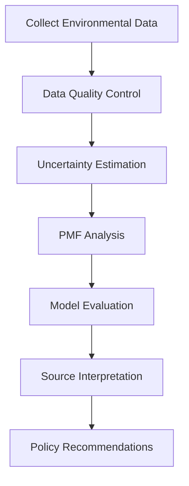

# PMF Basics

This guide explains the fundamental concepts behind Positive Matrix Factorization (PMF) and how it applies to environmental data analysis.

## What is PMF?

Positive Matrix Factorization (PMF) is a statistical technique used to identify and quantify sources of pollution in environmental data. It's particularly useful for **source apportionment** - determining what sources (traffic, industry, natural, etc.) contribute to measured pollutant concentrations.

### The Mathematical Foundation

PMF decomposes a data matrix **X** into two matrices:

**X = G × F + E**

Where:

- **X** (n×m): Measured concentrations (n samples × m chemical species)
- **G** (n×p): Factor contributions (n samples × p factors/sources)
- **F** (p×m): Factor profiles (p factors × m chemical species)
- **E** (n×m): Residual matrix (unexplained variance)


### Key Constraints

1. **Non-negativity**: All values in G and F must be ≥ 0
2. **Error weighting**: Uses measurement uncertainties to weight the fitting process
3. **Least squares**: Minimizes the sum of squared residuals weighted by uncertainties

## Why Use PMF?

### Advantages

- **Physically meaningful**: Non-negative constraints ensure realistic results
- **Uncertainty handling**: Incorporates measurement uncertainties
- **No a priori source profiles**: Doesn't require prior knowledge of source signatures
- **Robust**: Less sensitive to outliers than other factor analysis methods
- **Quantitative**: Provides both source profiles and contributions

### Limitations

- **Requires expertise**: Results need interpretation by domain experts
- **Local minimum**: May converge to suboptimal solutions
- **Factor number**: Choosing the right number of factors can be challenging
- **Rotational ambiguity**: Multiple mathematically equivalent solutions may exist

## PMF in Environmental Science

### Common Applications

1. **Air Quality**: PM2.5, PM10 source apportionment
2. **Water Quality**: Pollution source identification in water bodies
3. **Soil Contamination**: Heavy metal source apportionment
4. **Indoor Air**: Identifying indoor pollution sources

### Typical Workflow



## Understanding PMF Results

### Factor Contributions (G Matrix)

The G matrix shows **when and how much** each source contributed:

```python
# Example factor contributions
contributions = pmf.contributions_
print(contributions.head())
```

**Interpretation**:
- Each row represents a time point (sample)
- Each column represents a factor/source
- Values show the mass contribution from each source

### Factor Profiles (F Matrix)

The F matrix shows **what chemical signature** characterizes each source:

```python
# Example factor profiles
profiles = pmf.profiles_
print(profiles.head())
```

**Interpretation**:
- Each row represents a factor/source
- Each column represents a chemical species
- Values show the relative abundance of each species in the source

### Quality Metrics

#### Q-value (Goodness of Fit)

The Q-value measures how well the model fits the data:

```python
q_value = pmf.score(concentrations, uncertainties)
```

**Interpretation**:
- Lower Q-values indicate better fit
- Theoretical minimum: Q_theo = (n_samples × n_species) - (n_factors × (n_samples + n_species))
- Robust if Q_true/Q_theo ≈ 1

#### Residual Analysis

```python
# Calculate residuals
reconstructed = pmf.contributions_ @ pmf.profiles_
residuals = concentrations - reconstructed

# Scaled residuals
scaled_residuals = residuals / uncertainties
```

**Good model characteristics**:
- Residuals normally distributed around zero
- No systematic patterns in residuals
- |Scaled residuals| < 3 for most data points

## Source Identification

### Chemical Fingerprinting

Different sources have characteristic chemical signatures:

| Source Type | Key Tracers | Typical Profile |
|-------------|-------------|-----------------|
| Traffic | EC, OC, NO₃⁻, metals (Cu, Zn) | High EC/OC ratio |
| Coal Combustion | SO₄²⁻, As, Se, trace metals | High sulfate |
| Sea Salt | Na⁺, Cl⁻, Mg²⁺ | High Na/Cl ratio |
| Soil Dust | Al, Si, Ca, Ti, Fe | Crustal elements |
| Secondary Sulfate | SO₄²⁻, NH₄⁺ | High sulfate/low primary |
| Biomass Burning | K⁺, OC, levoglucosan | High K/EC ratio |

### Expert Interpretation

Successful PMF requires domain expertise to:

1. **Assign source names** based on chemical profiles
2. **Validate results** against known sources in the area
3. **Check seasonal patterns** for consistency
4. **Compare with other studies** in similar environments

## Model Validation

### Bootstrap Analysis

Test model stability by:

```python
# Pseudo-code for bootstrap validation
results = []
for i in range(100):
    # Resample data with replacement
    boot_data = concentrations.sample(frac=1, replace=True)
    boot_unc = uncertainties.loc[boot_data.index]

    # Fit PMF
    pmf_boot = PMF(n_components=5, random_state=i)
    pmf_boot.fit(boot_data, boot_unc)
    results.append(pmf_boot.profiles_)

# Analyze stability of profiles
```

### Displacement Analysis

Test factor number by:

1. Running PMF with p factors
2. Running PMF with p+1 factors
3. Checking if new factor splits existing factors

### External Validation

Compare with:
- **Emission inventories**: Known source locations and strengths
- **Meteorological data**: Wind patterns and source directions
- **Other studies**: Results from similar environments

## Best Practices

### Data Preparation

1. **Quality control**: Remove outliers and invalid data
2. **Species selection**: Include species with good signal-to-noise ratio
3. **Uncertainty estimation**: Use realistic uncertainty estimates
4. **Missing data**: Handle carefully or exclude

### Model Selection

1. **Start simple**: Begin with fewer factors, increase gradually
2. **Multiple runs**: Use different random seeds to check stability
3. **Physical constraints**: Ensure results make physical sense
4. **Cross-validation**: Use bootstrap or other validation methods

### Result Interpretation

1. **Domain knowledge**: Use local source knowledge
2. **Temporal patterns**: Check if seasonal patterns make sense
3. **Spatial coherence**: Compare with nearby sites if available
4. **Literature comparison**: Compare with published studies

## Common Pitfalls

### Data Issues

- **Bad uncertainty estimates**: Can lead to poor convergence
- **Too many zero values**: Can cause numerical instability
- **Correlated species**: May cause factor mixing
- **Outliers**: Can dominate factor profiles

### Model Issues

- **Wrong factor number**: Too few misses sources, too many creates splits
- **Poor convergence**: May indicate data problems or wrong parameters
- **Factor swapping**: Factors may swap between runs (use rotation)
- **Edge effects**: Factors with very low contributions may be artifacts

### Interpretation Issues

- **Over-interpretation**: Don't assign sources without chemical evidence
- **Ignoring uncertainty**: Always consider bootstrap confidence intervals
- **Temporal inconsistency**: Check if source patterns make temporal sense
- **Missing validation**: Always validate against external information

## Next Steps

- Learn about [Data Preparation](data-preparation.md) techniques
- Explore [Running Analysis](running-analysis.md) workflows
- Understand [Interpreting Results](interpreting-results.md) in detail
- See practical [Examples](../examples/datasets.md)
