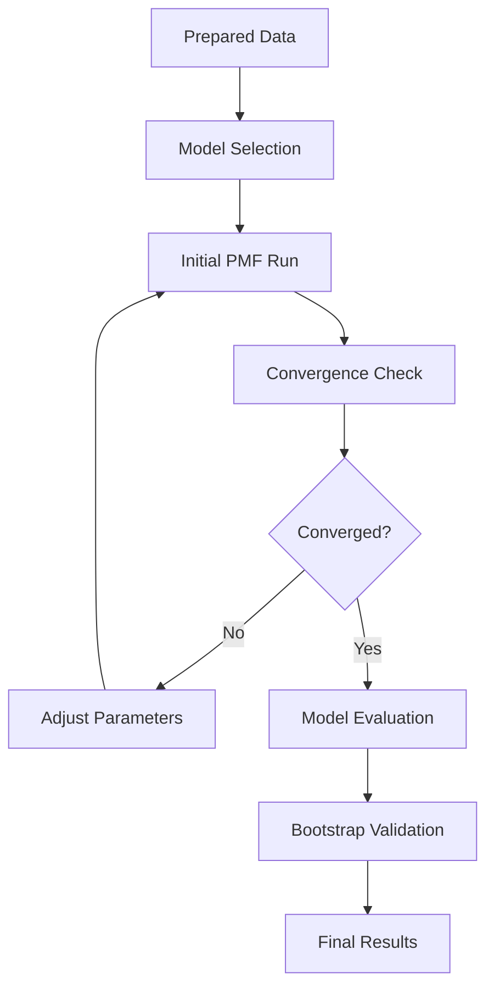

# Running Analysis

This guide walks through the complete process of running PMF analysis with Easy PMF, from model setup to result validation.

## Analysis Workflow



## Basic PMF Analysis

### Single Model Run

```python
import pandas as pd
from easy_pmf import PMF

# Load prepared data
concentrations = pd.read_csv('concentrations_clean.csv', index_col=0, parse_dates=True)
uncertainties = pd.read_csv('uncertainties_clean.csv', index_col=0, parse_dates=True)

# Initialize and fit PMF
pmf = PMF(n_components=5, random_state=42, max_iter=1000, tol=1e-4)
pmf.fit(concentrations, uncertainties)

# Check results
print(f"Converged: {pmf.converged_}")
print(f"Iterations: {pmf.n_iter_}")
print(f"Q-value: {pmf.score(concentrations, uncertainties):.2f}")
```

### Parameter Selection

#### Choosing Number of Components

```python
def analyze_factor_numbers(concentrations, uncertainties, n_range=range(3, 10)):
    """Systematically test different numbers of factors."""

    results = []

    for n_factors in n_range:
        print(f"Testing {n_factors} factors...")

        # Multiple runs with different random seeds
        q_values = []
        convergence_rates = []

        for seed in range(5):  # 5 runs per factor number
            pmf = PMF(n_components=n_factors, random_state=seed,
                     max_iter=1500, tol=1e-4)
            pmf.fit(concentrations, uncertainties)

            q_val = pmf.score(concentrations, uncertainties)
            q_values.append(q_val)
            convergence_rates.append(pmf.converged_)

        # Summary statistics
        result = {
            'n_factors': n_factors,
            'q_mean': np.mean(q_values),
            'q_std': np.std(q_values),
            'q_min': np.min(q_values),
            'convergence_rate': np.mean(convergence_rates),
            'q_values': q_values
        }
        results.append(result)

        print(f"  Q-value: {result['q_mean']:.1f} ± {result['q_std']:.1f}")
        print(f"  Convergence: {result['convergence_rate']:.1%}")

    return results

# Run factor number analysis
factor_results = analyze_factor_numbers(concentrations, uncertainties)

# Plot results
import matplotlib.pyplot as plt

fig, (ax1, ax2) = plt.subplots(1, 2, figsize=(15, 6))

# Q-values
n_factors = [r['n_factors'] for r in factor_results]
q_means = [r['q_mean'] for r in factor_results]
q_stds = [r['q_std'] for r in factor_results]

ax1.errorbar(n_factors, q_means, yerr=q_stds, marker='o', capsize=5)
ax1.set_xlabel('Number of Factors')
ax1.set_ylabel('Q-value')
ax1.set_title('Q-value vs Number of Factors')
ax1.grid(True, alpha=0.3)

# Convergence rates
conv_rates = [r['convergence_rate'] for r in factor_results]
ax2.bar(n_factors, conv_rates)
ax2.set_xlabel('Number of Factors')
ax2.set_ylabel('Convergence Rate')
ax2.set_title('Convergence Rate vs Number of Factors')
ax2.set_ylim(0, 1.1)

plt.tight_layout()
plt.show()
```

#### Advanced Parameter Tuning

```python
def parameter_sensitivity_analysis(concentrations, uncertainties, n_components=5):
    """Test sensitivity to different parameters."""

    # Test different tolerances
    tolerances = [1e-3, 1e-4, 1e-5, 1e-6]
    max_iters = [500, 1000, 2000, 3000]

    results = []

    for tol in tolerances:
        for max_iter in max_iters:
            pmf = PMF(n_components=n_components, random_state=42,
                     max_iter=max_iter, tol=tol)
            pmf.fit(concentrations, uncertainties)

            results.append({
                'tolerance': tol,
                'max_iter': max_iter,
                'converged': pmf.converged_,
                'n_iter': pmf.n_iter_,
                'q_value': pmf.score(concentrations, uncertainties)
            })

    return pd.DataFrame(results)

# Run parameter sensitivity
param_results = parameter_sensitivity_analysis(concentrations, uncertainties)
print("Parameter sensitivity results:")
print(param_results.groupby(['tolerance', 'max_iter']).agg({
    'converged': 'mean',
    'n_iter': 'mean',
    'q_value': 'mean'
}).round(3))
```

## Model Validation

### Convergence Diagnostics

```python
def detailed_convergence_analysis(concentrations, uncertainties, n_components=5):
    """Detailed analysis of model convergence."""

    # Run PMF with convergence history tracking
    pmf = PMF(n_components=n_components, random_state=42,
             max_iter=2000, tol=1e-6)
    pmf.fit(concentrations, uncertainties)

    # Plot convergence history
    if hasattr(pmf, '_convergence_history'):
        plt.figure(figsize=(12, 8))

        # Convergence plot
        plt.subplot(2, 2, 1)
        plt.semilogy(pmf._convergence_history)
        plt.xlabel('Iteration')
        plt.ylabel('Convergence Metric (log scale)')
        plt.title('Convergence History')
        plt.grid(True, alpha=0.3)

        # Add convergence threshold line
        plt.axhline(y=pmf.tol, color='r', linestyle='--',
                   label=f'Tolerance ({pmf.tol})')
        plt.legend()

        # Check for monotonic decrease
        history = np.array(pmf._convergence_history)
        increases = np.where(np.diff(history) > 0)[0]

        if len(increases) > 0:
            print(f"Warning: Convergence metric increased at iterations: {increases}")
            plt.scatter(increases, history[increases], color='red', s=50,
                       label='Increases', zorder=5)
            plt.legend()

    # Stability across random seeds
    plt.subplot(2, 2, 2)
    q_values = []
    seeds = range(10)

    for seed in seeds:
        pmf_test = PMF(n_components=n_components, random_state=seed)
        pmf_test.fit(concentrations, uncertainties)
        q_values.append(pmf_test.score(concentrations, uncertainties))

    plt.plot(seeds, q_values, 'bo-')
    plt.xlabel('Random Seed')
    plt.ylabel('Q-value')
    plt.title('Q-value Stability Across Seeds')
    plt.grid(True, alpha=0.3)

    # Factor profile stability
    plt.subplot(2, 2, 3)
    profile_correlations = []
    base_profiles = pmf.profiles_.values

    for seed in range(1, 10):
        pmf_test = PMF(n_components=n_components, random_state=seed)
        pmf_test.fit(concentrations, uncertainties)
        test_profiles = pmf_test.profiles_.values

        # Find best matching between factors (simple approach)
        correlations = []
        for i in range(n_components):
            max_corr = 0
            for j in range(n_components):
                corr = np.corrcoef(base_profiles[i], test_profiles[j])[0, 1]
                max_corr = max(max_corr, abs(corr))
            correlations.append(max_corr)

        profile_correlations.append(np.mean(correlations))

    plt.plot(range(1, 10), profile_correlations, 'go-')
    plt.xlabel('Random Seed')
    plt.ylabel('Mean Profile Correlation')
    plt.title('Profile Stability')
    plt.grid(True, alpha=0.3)

    # Residual analysis
    plt.subplot(2, 2, 4)
    reconstructed = pmf.contributions_.values @ pmf.profiles_.values
    residuals = concentrations.values - reconstructed
    scaled_residuals = residuals / uncertainties.values

    plt.hist(scaled_residuals.flatten(), bins=50, alpha=0.7, density=True)
    plt.xlabel('Scaled Residuals')
    plt.ylabel('Density')
    plt.title('Scaled Residuals Distribution')

    # Add normal distribution for comparison
    x = np.linspace(-4, 4, 100)
    plt.plot(x, norm.pdf(x, 0, 1), 'r-', label='Standard Normal')
    plt.legend()

    plt.tight_layout()
    plt.show()

    return pmf

# Run detailed convergence analysis
from scipy.stats import norm
best_pmf = detailed_convergence_analysis(concentrations, uncertainties, n_components=6)
```

### Bootstrap Validation

```python
def bootstrap_pmf(concentrations, uncertainties, n_components, n_bootstrap=100):
    """Bootstrap validation of PMF results."""

    print(f"Running {n_bootstrap} bootstrap samples...")

    bootstrap_results = {
        'q_values': [],
        'profiles': [],
        'contributions': []
    }

    n_samples = len(concentrations)

    for i in range(n_bootstrap):
        if (i + 1) % 20 == 0:
            print(f"  Completed {i + 1}/{n_bootstrap} bootstrap samples")

        # Bootstrap sampling with replacement
        bootstrap_indices = np.random.choice(n_samples, size=n_samples, replace=True)
        boot_conc = concentrations.iloc[bootstrap_indices]
        boot_unc = uncertainties.iloc[bootstrap_indices]

        # Fit PMF to bootstrap sample
        pmf_boot = PMF(n_components=n_components, random_state=i,
                      max_iter=1000, tol=1e-4)

        try:
            pmf_boot.fit(boot_conc, boot_unc)

            if pmf_boot.converged_:
                q_val = pmf_boot.score(boot_conc, boot_unc)
                bootstrap_results['q_values'].append(q_val)
                bootstrap_results['profiles'].append(pmf_boot.profiles_.values)
                bootstrap_results['contributions'].append(pmf_boot.contributions_.values)

        except Exception as e:
            print(f"Bootstrap sample {i} failed: {e}")
            continue

    print(f"Successfully completed {len(bootstrap_results['q_values'])} bootstrap samples")

    return bootstrap_results

def analyze_bootstrap_results(bootstrap_results, original_pmf):
    """Analyze bootstrap validation results."""

    q_values = np.array(bootstrap_results['q_values'])
    profiles = np.array(bootstrap_results['profiles'])

    print("=== Bootstrap Results ===")
    print(f"Q-value statistics:")
    print(f"  Mean: {np.mean(q_values):.2f}")
    print(f"  Std: {np.std(q_values):.2f}")
    print(f"  95% CI: [{np.percentile(q_values, 2.5):.2f}, {np.percentile(q_values, 97.5):.2f}]")

    # Profile stability analysis
    if len(profiles) > 0:
        # Calculate coefficient of variation for each factor-species combination
        profile_cv = np.std(profiles, axis=0) / np.mean(profiles, axis=0)

        # Mean CV across all factors
        mean_cv_by_factor = np.mean(profile_cv, axis=1)

        print(f"\nProfile stability (Coefficient of Variation):")
        for i, cv in enumerate(mean_cv_by_factor):
            print(f"  Factor {i+1}: {cv:.3f}")

        # Plot bootstrap confidence intervals
        fig, axes = plt.subplots(2, 3, figsize=(18, 12))
        axes = axes.flatten()

        n_factors = len(mean_cv_by_factor)
        species = original_pmf.profiles_.columns

        for factor_idx in range(min(n_factors, 6)):  # Plot first 6 factors
            ax = axes[factor_idx]

            # Original profile
            original_profile = original_pmf.profiles_.iloc[factor_idx]

            # Bootstrap profiles for this factor
            factor_profiles = profiles[:, factor_idx, :]

            # Calculate percentiles
            p25 = np.percentile(factor_profiles, 25, axis=0)
            p75 = np.percentile(factor_profiles, 75, axis=0)
            p5 = np.percentile(factor_profiles, 5, axis=0)
            p95 = np.percentile(factor_profiles, 95, axis=0)

            x = range(len(species))

            # Plot confidence intervals
            ax.fill_between(x, p5, p95, alpha=0.3, label='90% CI')
            ax.fill_between(x, p25, p75, alpha=0.5, label='50% CI')

            # Plot original profile
            ax.plot(x, original_profile, 'ro-', label='Original')

            ax.set_title(f'Factor {factor_idx + 1} Bootstrap Validation')
            ax.set_xlabel('Species')
            ax.set_ylabel('Profile Value')
            ax.set_xticks(x[::max(1, len(x)//10)])  # Show every 10th species
            ax.set_xticklabels(species[::max(1, len(species)//10)], rotation=45)
            ax.legend()
            ax.grid(True, alpha=0.3)

        plt.tight_layout()
        plt.show()

    return {
        'q_stats': {
            'mean': np.mean(q_values),
            'std': np.std(q_values),
            'ci_95': [np.percentile(q_values, 2.5), np.percentile(q_values, 97.5)]
        },
        'profile_cv': profile_cv if len(profiles) > 0 else None
    }

# Run bootstrap validation
bootstrap_results = bootstrap_pmf(concentrations, uncertainties, n_components=6, n_bootstrap=50)
bootstrap_stats = analyze_bootstrap_results(bootstrap_results, best_pmf)
```

## Model Comparison

### Displacement Analysis

```python
def displacement_analysis(concentrations, uncertainties, base_n_components):
    """Test if adding one more factor creates meaningful factors or just splits existing ones."""

    print(f"Displacement analysis: {base_n_components} vs {base_n_components + 1} factors")

    # Fit base model
    pmf_base = PMF(n_components=base_n_components, random_state=42)
    pmf_base.fit(concentrations, uncertainties)

    # Fit extended model
    pmf_ext = PMF(n_components=base_n_components + 1, random_state=42)
    pmf_ext.fit(concentrations, uncertainties)

    print(f"Base model ({base_n_components} factors):")
    print(f"  Q-value: {pmf_base.score(concentrations, uncertainties):.2f}")
    print(f"  Converged: {pmf_base.converged_}")

    print(f"Extended model ({base_n_components + 1} factors):")
    print(f"  Q-value: {pmf_ext.score(concentrations, uncertainties):.2f}")
    print(f"  Converged: {pmf_ext.converged_}")

    # Analyze factor contributions
    base_contributions = pmf_base.contributions_
    ext_contributions = pmf_ext.contributions_

    # Check if new factor has meaningful contribution
    new_factor_contribution = ext_contributions.iloc[:, -1]  # Last factor
    contribution_stats = {
        'mean': new_factor_contribution.mean(),
        'std': new_factor_contribution.std(),
        'max': new_factor_contribution.max(),
        'percent_of_total': new_factor_contribution.mean() / ext_contributions.sum(axis=1).mean() * 100
    }

    print(f"\nNew factor contribution statistics:")
    print(f"  Mean contribution: {contribution_stats['mean']:.3f}")
    print(f"  Std deviation: {contribution_stats['std']:.3f}")
    print(f"  Max contribution: {contribution_stats['max']:.3f}")
    print(f"  Percent of total: {contribution_stats['percent_of_total']:.1f}%")

    # Plot comparison
    fig, axes = plt.subplots(2, 2, figsize=(15, 12))

    # Base model contributions
    axes[0, 0].plot(base_contributions.index, base_contributions)
    axes[0, 0].set_title(f'Base Model ({base_n_components} factors)')
    axes[0, 0].set_ylabel('Contribution')
    axes[0, 0].legend([f'Factor {i+1}' for i in range(base_n_components)])

    # Extended model contributions
    axes[0, 1].plot(ext_contributions.index, ext_contributions)
    axes[0, 1].set_title(f'Extended Model ({base_n_components + 1} factors)')
    axes[0, 1].set_ylabel('Contribution')
    axes[0, 1].legend([f'Factor {i+1}' for i in range(base_n_components + 1)])

    # New factor profile
    new_factor_profile = pmf_ext.profiles_.iloc[-1]
    axes[1, 0].bar(range(len(new_factor_profile)), new_factor_profile)
    axes[1, 0].set_title('New Factor Profile')
    axes[1, 0].set_xlabel('Species')
    axes[1, 0].set_ylabel('Profile Value')
    axes[1, 0].set_xticks(range(0, len(new_factor_profile), max(1, len(new_factor_profile)//10)))

    # Q-value improvement
    q_improvement = pmf_base.score(concentrations, uncertainties) - pmf_ext.score(concentrations, uncertainties)
    axes[1, 1].bar(['Base Model', 'Extended Model'],
                   [pmf_base.score(concentrations, uncertainties),
                    pmf_ext.score(concentrations, uncertainties)])
    axes[1, 1].set_title(f'Q-value Comparison (Δ = {q_improvement:.2f})')
    axes[1, 1].set_ylabel('Q-value')

    plt.tight_layout()
    plt.show()

    return pmf_base, pmf_ext, contribution_stats

# Run displacement analysis
base_model, ext_model, new_factor_stats = displacement_analysis(concentrations, uncertainties, 5)
```

## Production PMF Analysis

### Complete Analysis Pipeline

```python
def run_production_pmf(concentrations, uncertainties, n_components,
                      output_dir='pmf_results', n_runs=10):
    """Run production-quality PMF analysis with multiple validation steps."""

    import os
    os.makedirs(output_dir, exist_ok=True)

    print("=== Production PMF Analysis ===")
    print(f"Data shape: {concentrations.shape}")
    print(f"Factors: {n_components}")
    print(f"Multiple runs: {n_runs}")

    # Step 1: Multiple runs to find best solution
    print("\nStep 1: Multiple runs for best solution...")
    best_q = float('inf')
    best_pmf = None
    all_runs = []

    for run in range(n_runs):
        pmf = PMF(n_components=n_components, random_state=run,
                 max_iter=2000, tol=1e-5)
        pmf.fit(concentrations, uncertainties)

        if pmf.converged_:
            q_val = pmf.score(concentrations, uncertainties)
            all_runs.append({
                'run': run,
                'q_value': q_val,
                'converged': True,
                'n_iter': pmf.n_iter_
            })

            if q_val < best_q:
                best_q = q_val
                best_pmf = pmf
        else:
            all_runs.append({
                'run': run,
                'q_value': None,
                'converged': False,
                'n_iter': pmf.n_iter_
            })

    runs_df = pd.DataFrame(all_runs)
    converged_runs = runs_df[runs_df['converged']]

    print(f"Convergence rate: {len(converged_runs)}/{n_runs} ({len(converged_runs)/n_runs:.1%})")
    if len(converged_runs) > 0:
        print(f"Best Q-value: {best_q:.2f}")
        print(f"Q-value range: {converged_runs['q_value'].min():.2f} - {converged_runs['q_value'].max():.2f}")

    # Step 2: Bootstrap validation of best solution
    print("\nStep 2: Bootstrap validation...")
    bootstrap_results = bootstrap_pmf(concentrations, uncertainties,
                                    n_components, n_bootstrap=50)
    bootstrap_stats = analyze_bootstrap_results(bootstrap_results, best_pmf)

    # Step 3: Save results
    print(f"\nStep 3: Saving results to {output_dir}...")

    # Save factor matrices
    best_pmf.contributions_.to_csv(f'{output_dir}/factor_contributions.csv')
    best_pmf.profiles_.to_csv(f'{output_dir}/factor_profiles.csv')

    # Save model metadata
    metadata = {
        'model_parameters': {
            'n_components': n_components,
            'max_iter': best_pmf.max_iter,
            'tolerance': best_pmf.tol,
            'random_state': best_pmf.random_state
        },
        'model_performance': {
            'q_value': best_q,
            'converged': best_pmf.converged_,
            'n_iterations': best_pmf.n_iter_,
            'convergence_rate': len(converged_runs) / n_runs
        },
        'bootstrap_validation': bootstrap_stats['q_stats'],
        'data_info': {
            'n_samples': len(concentrations),
            'n_species': len(concentrations.columns),
            'date_range': f"{concentrations.index.min()} to {concentrations.index.max()}",
            'species': list(concentrations.columns)
        }
    }

    import json
    with open(f'{output_dir}/model_metadata.json', 'w') as f:
        json.dump(metadata, f, indent=2, default=str)

    # Save run summary
    runs_df.to_csv(f'{output_dir}/all_runs_summary.csv', index=False)

    print("Analysis complete!")
    print(f"Results saved to: {output_dir}/")

    return best_pmf, metadata, bootstrap_stats

# Run production analysis
final_pmf, final_metadata, final_bootstrap = run_production_pmf(
    concentrations, uncertainties, n_components=6, n_runs=20
)
```

## Next Steps

With your PMF analysis complete, proceed to:

- [Interpreting Results](interpreting-results.md) - Understand your PMF outputs
- [Visualization](visualization.md) - Create publication-ready plots
- [Examples](../examples/baltimore.md) - See detailed real-world examples
